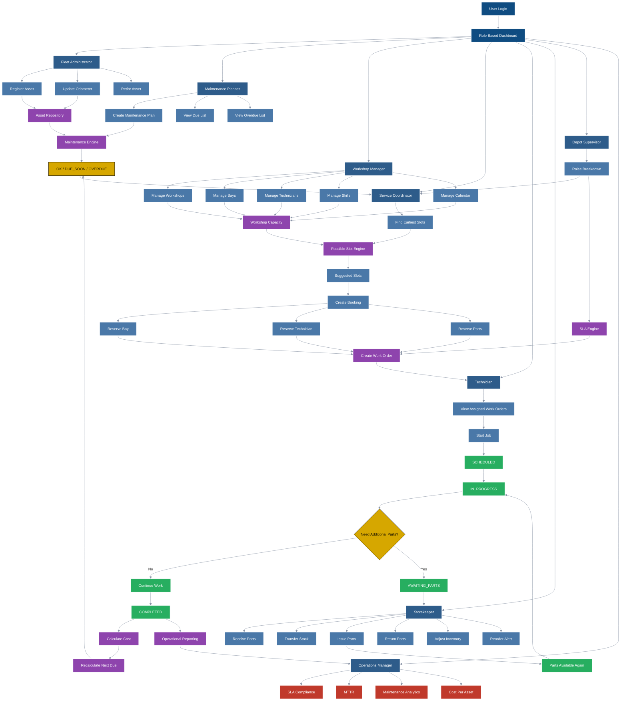

# FleetServe

## What This System Does

FleetServe is a fleet maintenance and workshop management platform. It maintains the vehicle asset register, derives preventive maintenance due dates, schedules jobs into constrained workshop capacity (bays and technicians), tracks work orders through execution, manages spare-parts inventory via an append-only ledger, and measures breakdown service levels (SLA) and reporting metrics such as MTTR and cost per asset.

## Setup

_(backend skeleton in progress)_

## Architecture Diagram

