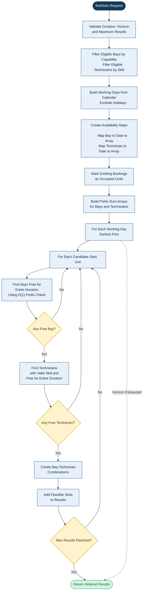

# Algorithmic Core: Feasible-Slot Engine

## Purpose

The Feasible-Slot Engine returns the earliest feasible workshop slots for a
requested duration, required bay capability, required technician skill,
working calendar, holidays, existing bookings, search horizon, and maximum
result count.

The engine is a pure and deterministic function. It has no Spring, JPA,
repository, database, system-clock, or external I/O dependency. Identical
inputs produce identical outputs.

## Function Signature

```text
findSlots(
    durationMinutes,
    requiredSkill,
    requiredCapability,
    candidateBays,
    candidateTechnicians,
    workingCalendar,
    holidays,
    existingBookings,
    searchHorizon,
    maxResults
) -> ordered list of feasible slots
```

## Design Decisions

### Search Horizon

`searchHorizon` contains:

```text
startDate
numberOfDays
```

The caller supplies both values so the engine does not read the system
clock.

The engine searches only within the supplied horizon. If fewer than
`maxResults` feasible slots exist, it returns the slots that exist.

### Slot Granularity

```text
15 minutes
```

Candidate start units are generated at 15-minute boundaries. This provides
useful scheduling precision while keeping candidate generation bounded.

### Jobs Spanning Working Days

```text
Not allowed
```

A slot must fit completely within one working day's opening and closing
times, using that day's own working-calendar entry.

### Time-Range Convention

All time ranges are half-open:

```text
[start, end)
```

The start is inclusive and the end is exclusive. Therefore, `09:00-11:00`
and `11:00-13:00` do not overlap.

### Deterministic Ordering

Results are ordered by:

```text
1. Day ascending
2. Start unit ascending
3. Bay ID ascending
4. Technician ID ascending
```

## Algorithm (in prose)

1. Filter `candidateBays` to active bays with `requiredCapability`, and
   `candidateTechnicians` to active technicians with `requiredSkill`;
   sort both lists by ID.
2. Build the list of working days inside `searchHorizon` using
   `workingCalendar`, excluding any date in `holidays`, and excluding any
   day that is not a working day.
3. For every eligible bay and every working day, create a zero-filled
   availability array sized to that day's working minutes divided by the
   slot granularity (0 = free, 1 = busy). Do the same for every eligible
   technician.
4. For each existing booking on a working day, convert its start and end
   time into unit indices relative to that day's opening time, and mark
   those units as busy (1) in the relevant bay and/or technician array.
5. Build a prefix-sum array from each availability array so that "is
   this resource free for units `[startUnit, endUnit)`" can be answered
   in O(1).
6. Walk working days earliest-first. Within each day, walk candidate
   start units earliest-first. For each candidate unit, use the prefix
   sums to collect every eligible bay that is free for the whole
   duration, then every eligible technician whose certification is
   valid for the whole duration and who is free for the whole duration.
7. Combine free bays and free technicians and append each combination to
   the result list until `maxResults` is reached, then return
   immediately.
8. If the horizon is exhausted before `maxResults` is reached, return
   whatever feasible slots were found.

## Flowchart



## Pseudocode

```text
FUNCTION findSlots(
    durationMinutes,
    requiredSkill,
    requiredCapability,
    candidateBays,
    candidateTechnicians,
    workingCalendar,
    holidays,
    existingBookings,
    searchHorizon,
    maxResults
)

    results = empty ordered list

    --------------------------------------------------
    STEP 1 : FILTER ELIGIBLE RESOURCES
    --------------------------------------------------

    eligibleBays =
        candidateBays
        FILTER active
        FILTER has requiredCapability
        SORT by bayId ascending

    IF eligibleBays is empty
        RETURN results

    eligibleTechnicians =
        candidateTechnicians
        FILTER active
        FILTER has requiredSkill
        SORT by technicianId ascending

    IF eligibleTechnicians is empty
        RETURN results

    --------------------------------------------------
    STEP 2 : BUILD WORKING DAYS (no job spans two days)
    --------------------------------------------------

    workingDays =
        dates from searchHorizon.startDate
        for searchHorizon.numberOfDays
        FILTER is a working day (workingCalendar)
        FILTER is not a holiday

    --------------------------------------------------
    STEP 3 : BUILD PER-DAY AVAILABILITY ARRAYS
             (0 = free, 1 = busy)
    --------------------------------------------------

    bayAvailability =
        Map<bayId, Map<date, array>>

    technicianAvailability =
        Map<technicianId, Map<date, array>>

    FOR EACH day IN workingDays

        unitsInDay =
            (workingCalendar.closeTime(day)
             - workingCalendar.openTime(day))
            / SLOT_GRANULARITY

        FOR EACH bay IN eligibleBays
            bayAvailability[bay.id][day] =
                array of size unitsInDay, all zeros

        FOR EACH technician IN eligibleTechnicians
            technicianAvailability[technician.id][day] =
                array of size unitsInDay, all zeros

    --------------------------------------------------
    STEP 4 : MARK EXISTING BOOKINGS AS BUSY
    --------------------------------------------------

    FOR EACH booking IN existingBookings

        day = booking's working day

        IF day is not in workingDays
            CONTINUE

        startUnit =
            (booking.startTime - workingCalendar.openTime(day))
            / SLOT_GRANULARITY

        endUnit =
            (booking.endTime - workingCalendar.openTime(day))
            / SLOT_GRANULARITY

        IF booking.bayId is in eligibleBays
            SET bayAvailability[booking.bayId][day]
                [startUnit .. endUnit) = 1

        IF booking.technicianId is in eligibleTechnicians
            SET technicianAvailability[booking.technicianId][day]
                [startUnit .. endUnit) = 1

    --------------------------------------------------
    STEP 5 : BUILD PREFIX SUM ARRAYS (O(1) range check)
    --------------------------------------------------

    FOR EACH bay, day, array IN bayAvailability
        bayPrefix[bay][day] = prefixSum(array)

    FOR EACH technician, day, array IN technicianAvailability
        technicianPrefix[technician][day] = prefixSum(array)

    --------------------------------------------------
    STEP 6 : SEARCH EACH DAY / EACH UNIT
    --------------------------------------------------

    requiredUnits =
        durationMinutes / SLOT_GRANULARITY

    FOR EACH day IN workingDays

        unitsInDay =
            (workingCalendar.closeTime(day)
             - workingCalendar.openTime(day))
            / SLOT_GRANULARITY

        lastPossibleStartUnit =
            unitsInDay - requiredUnits

        FOR startUnit FROM 0 TO lastPossibleStartUnit

            endUnit = startUnit + requiredUnits

            --------------------------------------------------
            STEP 7 : COLLECT FREE BAYS (single loop)
            --------------------------------------------------

            freeBays = empty list

            FOR EACH bay IN eligibleBays

                prefix = bayPrefix[bay.id][day]

                IF (prefix[endUnit] - prefix[startUnit]) == 0
                    ADD bay TO freeBays

            IF freeBays is empty
                CONTINUE   // skip to next unit

            --------------------------------------------------
            STEP 8 : COLLECT FREE TECHNICIANS (single loop)
            --------------------------------------------------

            candidateStart =
                workingCalendar.openTime(day)
                + startUnit * SLOT_GRANULARITY

            candidateEnd =
                candidateStart + durationMinutes

            freeTechnicians = empty list

            FOR EACH technician IN eligibleTechnicians

                IF technician certification
                   is not valid for the
                   entire candidate interval
                    CONTINUE

                prefix = technicianPrefix[technician.id][day]

                IF (prefix[endUnit] - prefix[startUnit]) == 0
                    ADD technician TO freeTechnicians

            IF freeTechnicians is empty
                CONTINUE   // skip to next unit

            --------------------------------------------------
            STEP 9 : COMBINE FREE BAYS x FREE TECHNICIANS
            --------------------------------------------------

            FOR EACH bay IN freeBays
                FOR EACH technician IN freeTechnicians

                    ADD FeasibleSlot(
                        bay.id,
                        technician.id,
                        candidateStart,
                        candidateEnd
                    )
                    TO results

                    IF size(results) == maxResults
                        RETURN results

    RETURN results
```

## Properties the Engine Must Satisfy

- Every returned slot lies entirely within that day's working hours.
- No returned slot falls on a holiday.
- The returned bay has `requiredCapability`.
- The returned technician holds `requiredSkill`, valid for the whole slot.
- The bay is free for the entire duration, not merely at the start
  instant.
- The technician is free for the entire duration, not merely at the
  start instant.
- No returned slot overlaps an existing booking for its bay or
  technician.
- Results are sorted earliest-first and ties are broken deterministically
  by bay ID then technician ID.
- Identical inputs always produce identical outputs.
- The result count never exceeds `maxResults`.
- If fewer than `maxResults` feasible slots exist in the horizon, the
  engine returns what exists instead of searching indefinitely.
- No feasible slot earlier than the first returned slot exists.

## Complexity Analysis

Named inputs:

```text
B = number of eligible bays
T = number of eligible technicians
E = number of existing bookings
D = horizon length, in working days
U = units per working day (working minutes / slot granularity)
```

Building availability arrays and marking bookings:

```text
O(D * (B + T) * U + E)
```

Building prefix-sum arrays:

```text
O(D * (B + T) * U)
```

Searching for feasible slots (each range check is O(1)):

```text
O(D * U * (B + T))
```

Total time complexity:

```text
O(D * (B + T) * U + E)
```

Space complexity:

```text
O(D * (B + T) * U)
```

## Rejected Alternative

**Alternative considered:** instead of per-day availability arrays and
prefix sums, keep bookings in a single sorted list per bay and per
technician, and check each candidate slot with a binary-search-based
`overlapsAny` lookup against that sorted list.

```text
FUNCTION overlapsAny(candidateStart, candidateEnd, sortedBookings):

    IF sortedBookings is empty:
        RETURN false

    index = lowerBound(
        sortedBookings,
        booking.startTime >= candidateEnd
    )

    IF index == 0:
        RETURN false

    previous = sortedBookings[index - 1]

    RETURN candidateStart < previous.endTime
       AND previous.startTime < candidateEnd
```

Under this alternative, bookings are grouped by bay and by technician and
sorted once:

```text
bookingsByBay =
    GROUP relevantBookings BY bayId

bookingsByTechnician =
    GROUP relevantBookings BY technicianId
```

and each candidate slot is checked directly against these sorted lists
with `overlapsAny`, instead of against a prefix-sum array.

Named inputs for this alternative:

```text
D = number of days in the search horizon
S = candidate start times per working day
B = number of eligible bays
T = number of eligible technicians
E = number of relevant existing bookings
N = maximum bookings indexed for one resource
```

Complexity of this alternative:

```text
Building and sorting the booking indexes: O(E log E)
Each overlap lookup: O(log N)
Worst-case slot search: O(D * S * B * T * log N)

Total time: O(E log E + D * S * B * T * log N)
Space: O(E + B + T + maxResults)
```

## Why It Was Rejected

The rejected approach checks each bay and technician one at a time against its booking list, for every candidate start time. Cost grows with booking history — the more bookings pile up over time, the slower every search gets, even though most of that history is irrelevant to the current search window.

The per-day availability array with prefix sums avoids this. Once built, checking "is this resource free for this duration" is a fixed-cost lookup, independent of how much booking history exists.

**Example** (5 bays, 8 technicians, 14-day horizon, 15-min slots, ~12 bookings/resource):

- Booking-list check: ~65,000 comparisons
- Prefix-sum array: ~12,000 comparisons, flat regardless of history size


**Why it was rejected:** it repeats an `O(log N)` lookup for every
bay/technician at every candidate start, and re-derives "is the whole
`[start, end)` interval free" from booking comparisons each time. The
per-day availability array with prefix sums instead answers "is this
resource free for this whole duration" in O(1) once the arrays are
built, which is simpler to reason about and to test, at the cost of the
extra memory used by the daily arrays. Since a working day is bounded
(a few hundred units at 15-minute granularity), that memory cost is
small relative to the benefit.

## Chosen Slot Granularity and Justification

```text
Chosen: 15 minutes
```

Fine enough to not miss realistic appointment times, coarse enough to keep arrays small (36 units/day for a 9-hour day).
